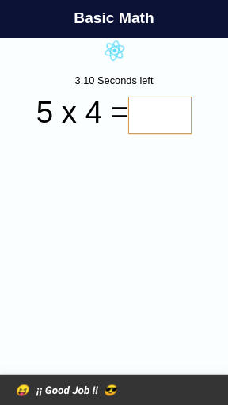
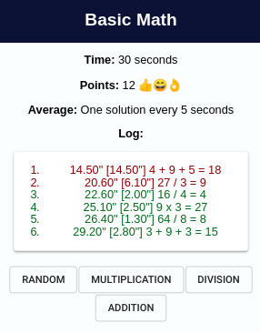

# Basic Math

You have to answer as many math questions as possible in a short period of time. Questions might be `6 * 8`, `5 + 3 + 8` or `56 / 8`.

It's a simple ReactJS app, here are some screenshots:

## Install

    yarn install
    yarn test
    yarn start

Enjoy!
